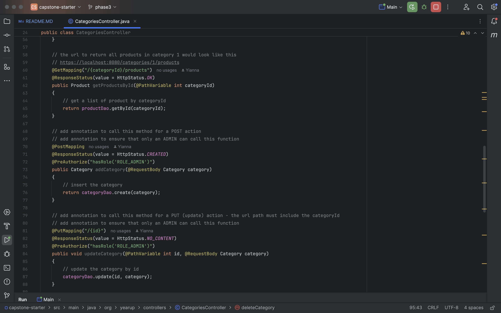

# Easy Shop
## Capstone Three
### Overview
Easy Shop is a full-featured shopping application developed as part of Capstone Three. The project is divided into several phases, each focusing on different aspects of the application development, including category management, product management, and shopping cart functionality.

### Phase 1: Categories Controller
In Phase 1, we focused on adding the categories controller and achieving full CRUD (Create, Read, Update, Delete) operations for categories. This phase also included the implementation of category search functionality and user authentication.

Click here to see screenshots

### Phase 2: Bug Management 
Phase 2 involved fixing two major bugs:

Fixing the product search functionality to ensure that only the admin can insert, update, and delete products.
Fixing the update functionality for products.

Click here to see screenshots

### Phase 3: Shopping Cart Functionality
Phase 3 included implementing full CRUD operations for the shopping cart. Users can add items to their cart, update quantities, and clear their cart. The cart is refreshed and cleared when the clear button is selected.

Click here to see screenshots

### Future Features

If more time was permited I would:
- finish phase 4 and 5
- I would also add more functionality to the profile (Phase 4) and include the user's photo 
- I would also add favorite purchases and have it persist.

### Developers Thoughts 
I do not have a favorite piece of code but I did like the fact that we could interact with the frontend and get more experience with a full stack application.